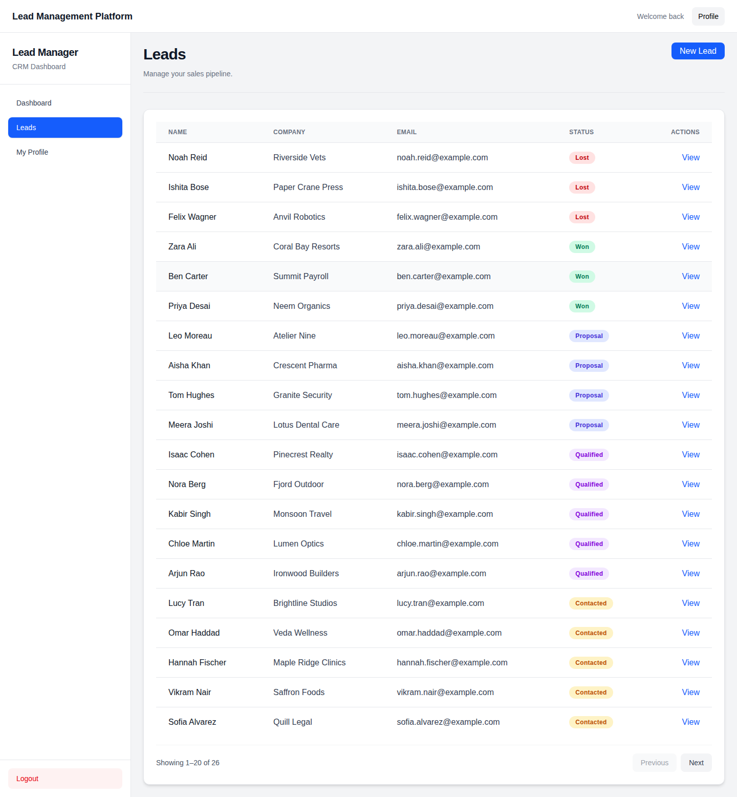
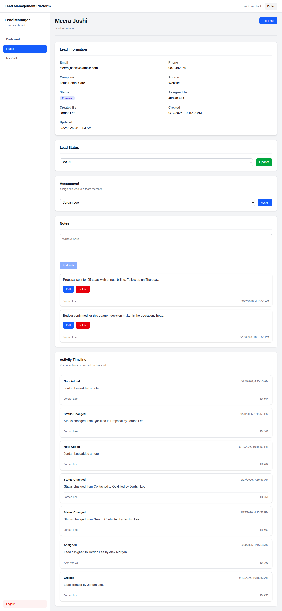

A lead management platform: a Django REST Framework API that captures, assigns and moves sales leads through a validated pipeline, recording every change on a timeline, with a React and TypeScript app on top. It is built API-first, and the web app's types are generated from the API's OpenAPI schema.

[](https://github.com/code-kasha/lead-platform/actions/workflows/ci.yml)
[](https://github.com/code-kasha/lead-platform/releases/latest)
[](https://github.com/code-kasha/lead-platform/pkgs/container/lead-platform)
[](LICENSE)
[](https://www.python.org/)
[](https://docs.djangoproject.com/en/6.1/)
[](https://www.django-rest-framework.org/)
[](https://react.dev/)
[](https://www.typescriptlang.org/)

[Live demo](https://lead-platform-c3mw.onrender.com/) (until 26 December 2026) · [Download v1.0.0](https://github.com/code-kasha/lead-platform/releases/latest) · [API reference](docs/api.md) · [Swagger UI](https://lead-platform-c3mw.onrender.com/api/docs/) · [Deploy it yourself](docs/DEPLOY.md) · [Changelog](CHANGELOG.md) · [Contributing](CONTRIBUTING.md)



- **REST API** for leads, assignment, notes and an activity timeline, with OpenAPI 3 docs (Swagger UI and ReDoc).
- **A status pipeline enforced in one place**: New → Contacted → Qualified → Proposal → Won, or Lost. A blocked change returns `400` with the reason.
- **An automatic, transactional audit trail**: every create, edit, status change, assignment and note is recorded in the same transaction as the change.
- **Role-based access**: Admins manage everything. Members see and work on only the leads they created or are assigned to.
- **JWT authentication** with rotating, blacklisted refresh tokens.
- **A public enquiry form endpoint**, rate-limited per client.
- **A React 19 + TypeScript app** whose API types are generated from the schema, never written by hand.
- **99 backend and 74 frontend tests**, and CI that fails if the schema or the generated types go stale.
- **One Docker image** (amd64 and arm64) serving the API, admin and web app, published to the GitHub Container Registry.

> **Status:** complete as of v1.0.0 and not actively maintained. It works as-is; fork it, reuse it, grow it.
>
> **Demo:** [lead-platform-c3mw.onrender.com](https://lead-platform-c3mw.onrender.com/) runs until 26 December 2026 on a free tier, so the first request after a quiet spell takes about a minute. After that date, run it yourself with Docker or Python.

## Quick start

Install [Git](https://git-scm.com/downloads), then clone the repository. Every command below runs from its folder:

```sh
git clone https://github.com/code-kasha/lead-platform.git
cd lead-platform
```

**With Docker Compose.** It builds the image and runs it against Postgres:

```sh
docker compose up --build
```

Then open [localhost:8000](http://localhost:8000/) and sign in as `admin@example.com` / `admin-demo-password`. The API docs are at [/api/docs/](http://localhost:8000/api/docs/).

**With the published image.** No clone needed. SQLite stands in for Postgres here, so this is only for trying it out:

```sh
docker run -d --rm --name lead-demo -p 127.0.0.1:8000:8000 \
  -e SECRET_KEY=try-it-locally-only-not-a-real-secret-key \
  -e DATABASE_URL=sqlite:////tmp/demo.sqlite3 \
  -e ALLOWED_HOSTS=localhost,127.0.0.1 \
  -e CORS_ALLOWED_ORIGINS=http://localhost:8000 \
  -e CSRF_TRUSTED_ORIGINS=http://localhost:8000 \
  -e SECURE_SSL_REDIRECT=False \
  -e DJANGO_SUPERUSER_EMAIL=admin@example.com \
  -e DJANGO_SUPERUSER_PASSWORD=admin-demo-password \
  ghcr.io/code-kasha/lead-platform:v1.0.0
```

Then open [localhost:8000](http://localhost:8000/). Run `docker stop lead-demo` when finished.

**With Python and Node.js.** Requires Python 3.12 or later, Node.js 22 and [pnpm](https://pnpm.io/). Copy `.env.example` to `.env`, then set `SECRET_KEY` to any long random string and `DATABASE_URL` to a Postgres URL, or to `sqlite:///db.sqlite3` to try it out.

```sh
cd backend
python -m venv .venv && source .venv/bin/activate   # Windows: .venv\Scripts\activate
pip install -r requirements.txt
python manage.py migrate
python manage.py createsuperuser
python manage.py runserver                          # API on http://127.0.0.1:8000
```

In a second terminal:

```sh
cd frontend
pnpm install
pnpm dev                                            # app on http://localhost:5173
```

## The backend

A Django project with three apps: `accounts` (users, roles, JWT), `leads` (leads, notes, activities) and `common` (shared base model, pagination, the web app's catch-all route).

### Layers

```text
Request → View → Serializer → Service → Database
```

- **Views** handle HTTP only: permissions, picking a serializer, calling a service, returning a response.
- **Serializers** validate input and shape output. They are split by purpose under `apps/leads/serializers/`, so the fields a client may write (contact details) are separate from the fields it only reads (status, owner, assignee).
- **Services** (`apps/leads/services.py`) hold the business rules. Each one is a `@transaction.atomic` function with keyword-only arguments, and they are the **only** code that writes activity records. A change and its timeline entry are saved together, or neither is.

### Rules the API enforces

- **The status pipeline.** Allowed transitions are one mapping in `apps/leads/constants.py`, applied by `change_lead_status`. Status can only change through `POST /api/leads/{id}/status/`; a `status` sent to the edit endpoints is ignored.
- **Visibility and roles.** The lead queryset itself is filtered by role, so a Member asking for someone else's lead gets `404`, not `403`, and the API doesn't reveal that it exists. Object permissions decide who may edit, delete, assign, change status, and edit or delete a note. [The full table](docs/api.md#roles-and-access) is in the API reference.
- **Tokens.** Access tokens last 15 minutes. Refresh tokens last 7 days, rotate on every use, and are blacklisted once used or on logout.
- **The public form** (`POST /api/leads/public/`) needs no login and is throttled per client (`PUBLIC_LEADS_RATE`, default 20 an hour). Its leads have no creator, and their timeline says they came from the form.
- **Listing.** Filter by status, assignee, creator and company. Search name, email, phone and company. Sort by created, updated, name or status. Pages are 20 by default, up to 100. Querysets use `select_related`, so a page costs a fixed number of queries.

### API-first

`drf-spectacular` generates the OpenAPI 3 schema from the code, with operation IDs, examples and error responses. The schema is committed as [`backend/schema.yml`](backend/schema.yml), and the frontend generates its TypeScript types from it with `openapi-typescript`. CI regenerates both (with `--validate --fail-on-warn`) and fails if either committed copy differs. The code, the docs and the client can't drift apart.

### Production settings

- Settings are split into `base`, `development` and `production`, picked by `DJANGO_ENV`.
- Production refuses to start if `SECRET_KEY`, `DATABASE_URL` or the host and origin lists are missing, and names the missing one.
- It uses HTTPS redirects, secure cookies, HSTS (configurable), timestamped console logging, and WhiteNoise for static files with compression and long-lived caching of hashed assets.
- The container applies migrations and creates the first admin from environment variables on start. This is idempotent, and it never overwrites a changed password.

### Tests

99 pytest tests across the apps. They cover:

- Login, token refresh with rotation and blacklisting, logout, and the current user.
- Visibility for each role, and every permission rule.
- Create and edit, and the activities they record.
- Every allowed and blocked status transition.
- Assignment, and notes and their owners.
- Filtering, search, ordering and pagination.
- The public form and its rate limit.
- The production settings checks.

## The frontend

React 19, TypeScript, Vite, TanStack Query, React Router, React Hook Form with Zod, and Tailwind CSS.

- **Typed end to end:** `src/types/api.ts` is generated from the backend's schema, and the axios client and pages use those types.
- **Sign-in that survives expiry:** a route guard sends signed-out visitors to `/login` and returns them to the page they asked for. On a `401`, the client refreshes the token once, shared by every request waiting on it, because a rotated refresh token can only be used once. Then it retries, or ends the session cleanly.
- **Server state in TanStack Query:** mutations update or invalidate the exact queries they affect, so status, assignment, notes and the timeline stay in step without reloading the page.
- **Pages:** a public enquiry form, sign-in, a dashboard, a paginated lead list, create and edit forms, and a lead page with status, assignment, notes and the activity timeline.
- **74 Vitest + Testing Library tests** run against the rendered pages. The lead page tests use a fake API that enforces the backend's status rules.



More in [`screenshots/`](screenshots/): the [public form](screenshots/public-form.png), [sign-in](screenshots/login.png), [dashboard](screenshots/dashboard.png), [lead form](screenshots/lead-form.png) and [Swagger UI](screenshots/swagger.png).

## Use it in your application

- **Call the API** from any language. It is plain JSON over HTTP with an OpenAPI schema at `/api/schema/`, so you can generate a client. The [API reference](docs/api.md) has every endpoint, rule and example.
- **Send enquiries from your website** to `POST /api/leads/public/`. Each one arrives as a new lead with its own timeline.
- **Run the Docker image** (`ghcr.io/code-kasha/lead-platform`) as your team's lead tracker, with any Postgres database.

## Deploy it yourself

[docs/DEPLOY.md](docs/DEPLOY.md) covers:
- Running the published image on any host.
- The free Render and Neon setup the live demo uses: `render.yaml` is a ready-made blueprint.
- Every environment variable.
- How the image is built.
- How CI publishes releases.

## For developers

```text
backend/
  apps/accounts/      custom user (email login), roles, JWT views, ensure_superuser
  apps/leads/         models, services, status transitions, permissions, filters,
                      serializers/ and views/ split by concern, OpenAPI docs, tests
  apps/common/        base model, pagination, the web app's catch-all view
  config/settings/    base, development and production, chosen by DJANGO_ENV
  schema.yml          the OpenAPI schema, committed and checked by CI
frontend/
  src/api/            axios client with single-flight token refresh
  src/types/api.ts    generated from backend/schema.yml
  src/pages/          route-level views, with tests alongside
  src/routes/         router and the auth guard
  src/test/           render helpers, fixtures and a fake lead API
docs/                 API reference, deployment, architecture notes
Dockerfile            builds the web app, then one image serves API, admin and app
```

The main checks, which CI also runs on every push and pull request along with a Docker build and smoke test:

```sh
# backend/
flake8
python manage.py makemigrations --check --dry-run
python manage.py spectacular --validate --fail-on-warn --file schema.yml
pytest

# frontend/
pnpm lint && pnpm test && pnpm build
```

[`CONTRIBUTING.md`](CONTRIBUTING.md) lists the rules the code keeps. [docs/ARCHITECTURE.md](docs/ARCHITECTURE.md) and the numbered notes in [docs/](docs/) record the design decisions.

## Where this could go

lead-platform is finished, but it is the first piece of a fuller CRM, and there is plenty of room to grow it:

- **Contacts, companies and deals** as their own records, so a won lead becomes a customer with deals that have a value and an expected close date.
- **Tasks and reminders** on leads, with due dates and notifications for the assignee.
- **Pipeline analytics:** conversion rates between stages, time spent in each stage, and win rates by source and by member.
- **Email and calendar integration**, so conversations land on the timeline automatically.
- **Webhooks and CSV import and export**, to connect other tools and bring in existing lists.
- **Teams and multiple organisations**, with per-team pipelines and custom stages.
- **Background jobs and a shared cache** (Celery and Redis) for notifications, imports, and rate limits shared across workers.

## Contributing, license and credit

lead-platform is complete as of v1.0.0 and not actively maintained: issues and pull requests may go unanswered, so fork it freely. The code is under the [MIT License](LICENSE) with no extra conditions.

If you build on it, [`CONTRIBUTING.md`](CONTRIBUTING.md) explains how the code is organised and how to release a fork. A mention is appreciated, never required.

Created by Akash Damle ([@code-kasha](https://github.com/code-kasha)).
